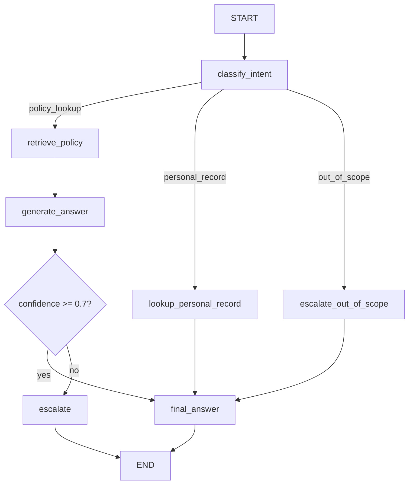

# HR Policy Assistant

An agentic HR Policy Assistant built with LangGraph, LangChain, and LangSmith. Employees ask natural language questions about company HR policies and receive grounded, accurate answers with source citations — or get escalated to a human HR rep when the agent's confidence is low.

## Quickstart

```bash
# 1. Clone and install
pip install -r requirements.txt

# 2. Configure environment
cp .env.example .env
# Fill in OPENAI_API_KEY and LANGCHAIN_API_KEY

# 3. Run interactive mode (with streaming)
python3 -m src.main

# 4. Or single question
make dev QUESTION="How many days of annual leave do I get?"

# 5. Run evals (logs results to LangSmith)
make eval

# 6. Docker
docker build -t hr-assistant .
docker run --env-file .env hr-assistant
```

## Graph Diagram



## Architecture Decisions

### Intent Classification First
Rather than sending every question through RAG, the entry node classifies intent and routes accordingly:
- **Policy questions** → RAG pipeline
- **Personal record questions** → tool call (employee lookup)
- **Out of scope** → direct rejection, no wasted retrieval calls

Trade-off: adds one extra LLM call per question. Worth it — keeps retrieval clean and makes the graph readable. In production I'd evaluate embedding-based classification as a cheaper alternative.

### Confidence-Based Escalation
The model self-assesses confidence when generating answers. Below 0.7 (configurable via `CONFIDENCE_THRESHOLD`), the question escalates to a human HR rep rather than risking a wrong answer. In HR, a wrong policy answer has real consequences.

### RAG Chunking Strategy
Chunks at 500 tokens with 50-token overlap:
- 500 tokens is specific enough to retrieve precise policy clauses
- 50-token overlap prevents answers being split across chunk boundaries
- Validated against 9 eval cases — retrieval quality was good at this size

### Eval Design
Used keyword matching rather than LLM-as-judge. Reasoning: keyword matching is deterministic, fast, and free — no extra API calls per eval run. For a demo dataset of 9 cases it's sufficient. The tradeoff is brittleness ("25 days" vs "twenty-five days" would fail) — in production I'd add embedding similarity or LLM-as-judge for semantic correctness.

### Source Citations
Every policy answer includes the source document(s) that informed it. This makes answers auditable and traceable — important in enterprise HR contexts where employees may need to verify claims against the original policy.

### PII Redaction Before Tracing
Employee IDs, emails, and phone numbers are redacted before questions are sent to LangSmith traces. The agent operates on the original question internally but logs only the redacted version — keeping employee data out of third-party observability tools.

### Multi-Turn Conversation History
The agent maintains conversation history in state and injects the last 4 turns into the prompt context. Allows follow-up questions like "what about for part-time employees?" without losing context.

### Streaming Output
The interactive CLI streams the answer character-by-character. Implementation note: we use structured JSON output (`{"answer": ..., "confidence": ...}`) which can't be parsed mid-stream, so we invoke fully then stream the parsed answer text. True token streaming would require separating answer generation from confidence scoring into two passes.

### Provider
Using `gpt-4o-mini` — fast, cheap, and sufficient for classification + RAG-grounded generation. The LangChain abstraction makes swapping to Claude, Groq, or Llama trivial via config.

## Known Tradeoffs

### Two LLM calls per policy question
Intent classification adds one extra LLM call before every question. The tradeoff is worth it for graph clarity and retrieval quality, but in production I'd benchmark embedding-based classification as a faster, cheaper alternative.

### FAISS rebuilt on each process start
The vector index is rebuilt from documents every time the process starts. Fine for a demo with 3 documents — in production this would be persisted to disk or replaced with a hosted vector DB.

### Self-assessed confidence is unreliable
The model scores its own confidence in the same call that generates the answer. LLMs can be overconfident on plausible-sounding but wrong answers. In production, confidence calibration should be external — e.g. comparing retrieved chunk similarity scores against a threshold, or a separate validation pass.

### Conversation history is in-memory only
History is maintained in state during a session but lost when the process ends. No persistence between sessions. In production this would be stored in a database keyed by user/session ID.

## What I'd Improve With More Time
- **True token streaming** — separate answer and confidence into two passes to enable real `astream_events` streaming
- **Persistent vector store** — persist FAISS index to disk or use a hosted vector DB (Pinecone, pgvector)
- **Semantic eval scoring** — replace keyword matching with embedding similarity or LLM-as-judge
- **Document versioning** — track when policies change and invalidate stale embeddings
- **Auth** — real employee authentication before allowing personal record lookups
- **Retry logic** — exponential backoff on LLM/API failures
- **More tool integrations** — connect to a real HRIS system rather than stubbed data
- **Multi-tenant isolation** — separate document access and conversation history per employee/team; a day-one requirement in any real enterprise deployment
- **External confidence calibration** — replace self-assessed confidence with retrieval similarity scores or a separate validation pass
